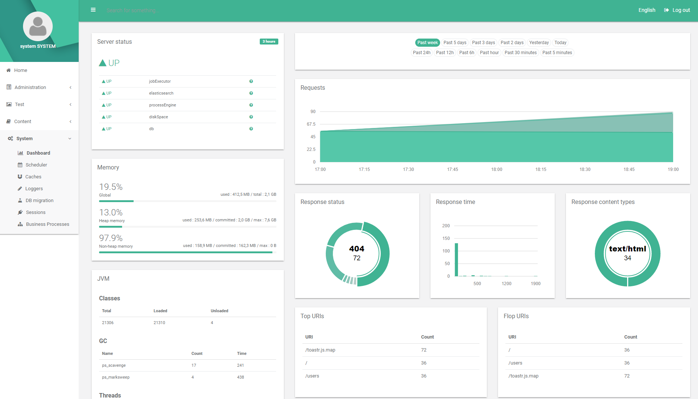

  

# Blossom
Blossom is a Java framework base on Spring-Boot which enables you to realize your projects quickly and smoothly. It comes with several modules and tools made to ease and speed up your development process.

Documentation can be found here : https://blossom-project.com/documentation

The initializr can be found here : https://blossom-project.com/initializr

Samples can be found here : https://github.com/blossom-project/blossom-samples

